# RavfalHomestay-house-boarding
This is the first project that i start
The theme is boarding house, in this web based application we can become a owner (admin) or customer (buyer) with different menu access

# Screenshot

- Dashboard (guest)

 

- Dashboard (member) (different Word and add rules)

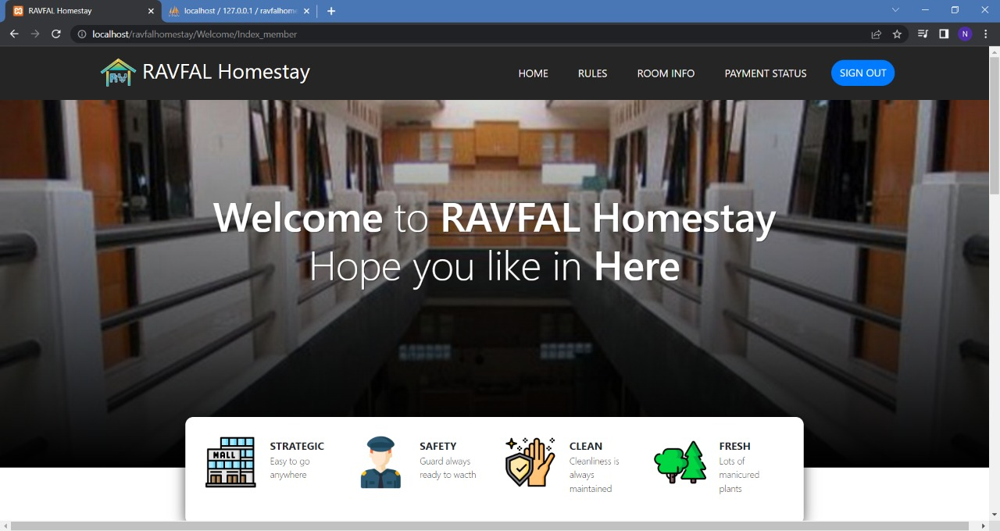
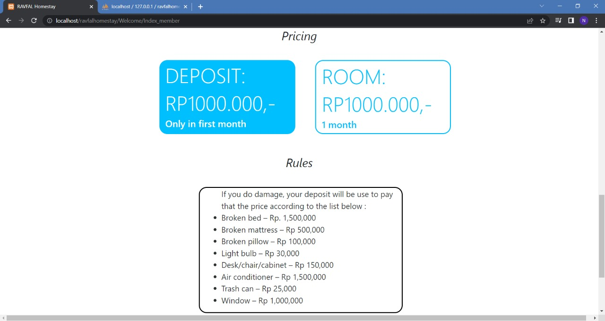

- Room Info (guest)

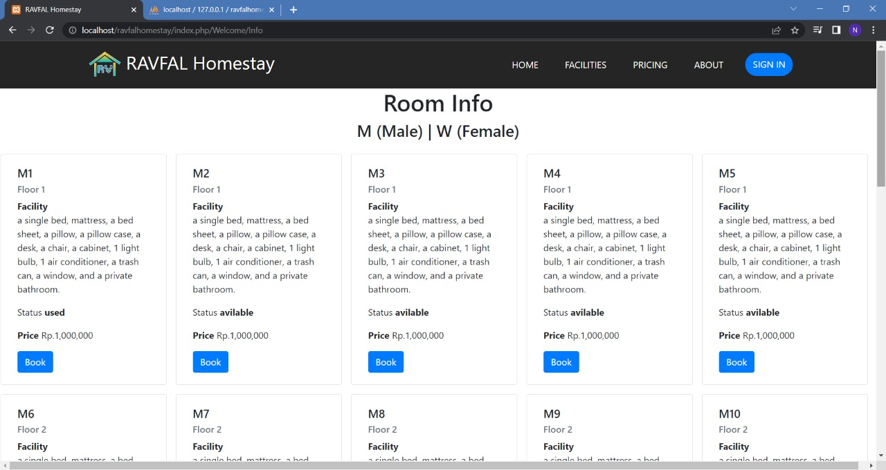

- Login Page

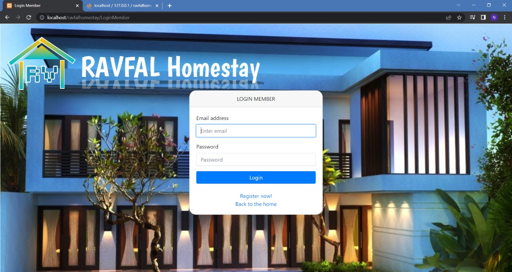

- Registeration Page

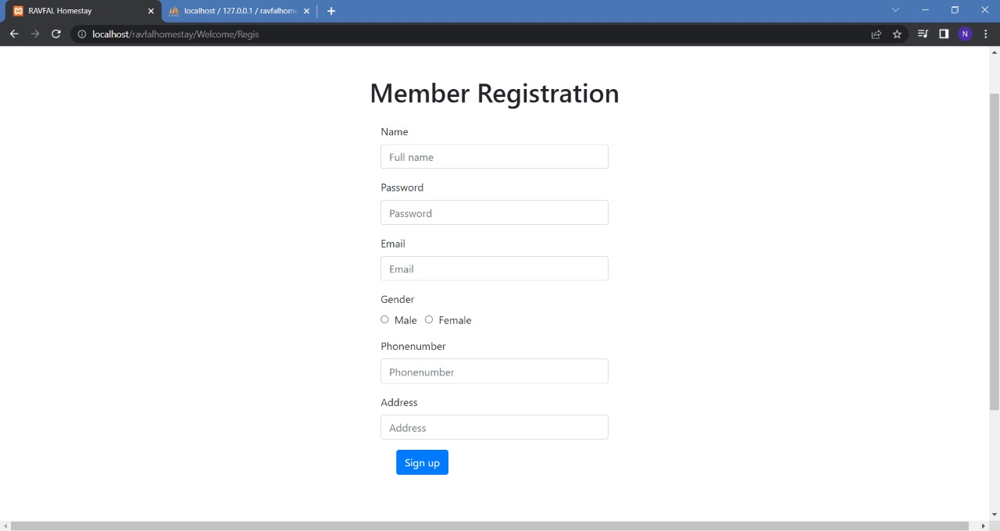

- Admin Menu

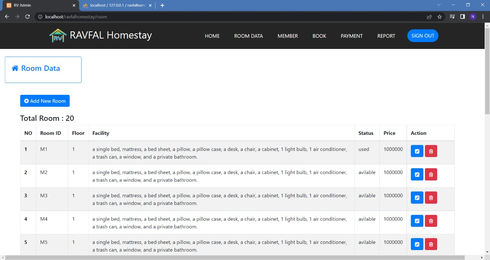
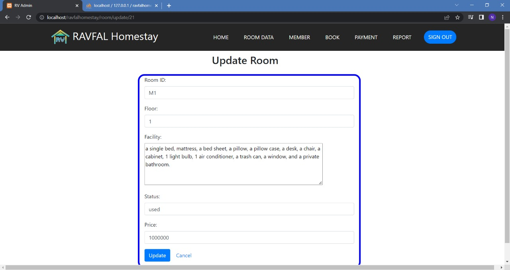
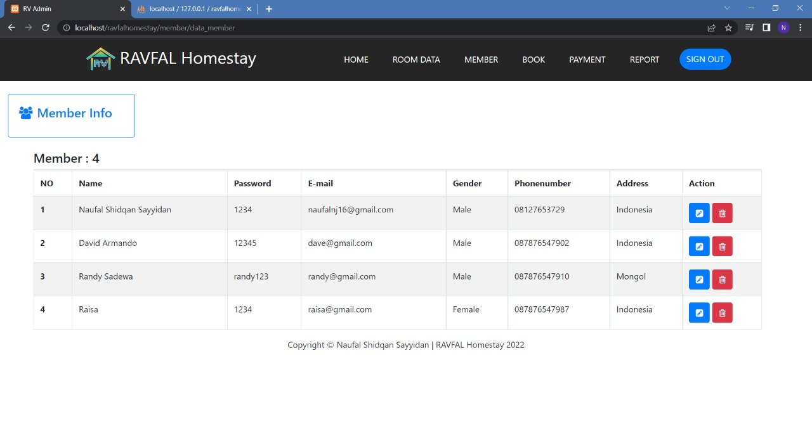
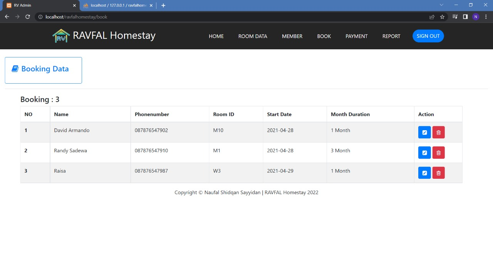
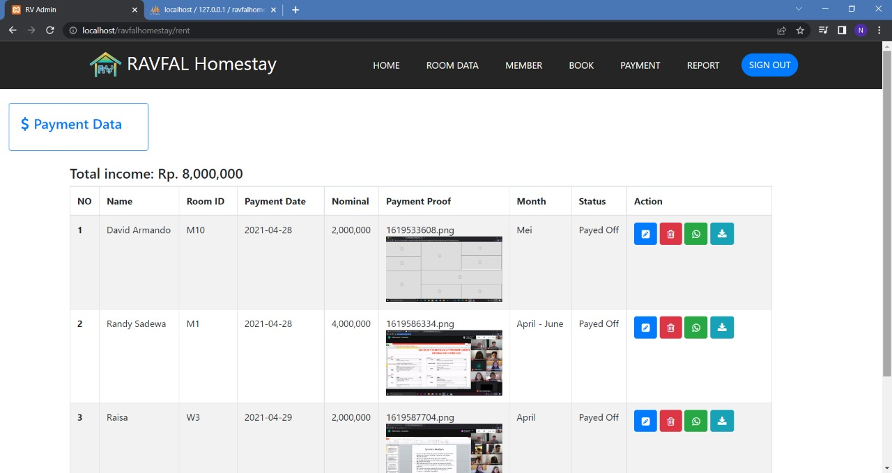
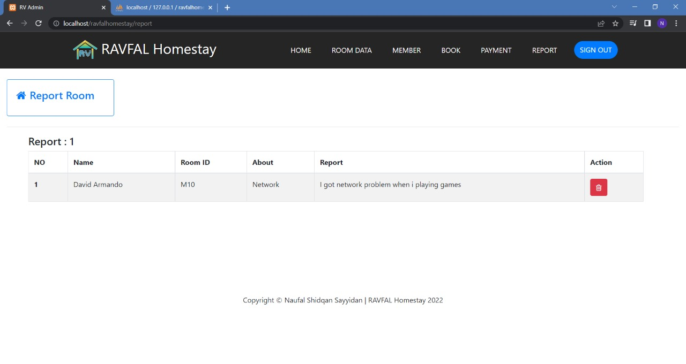

- Member Menu
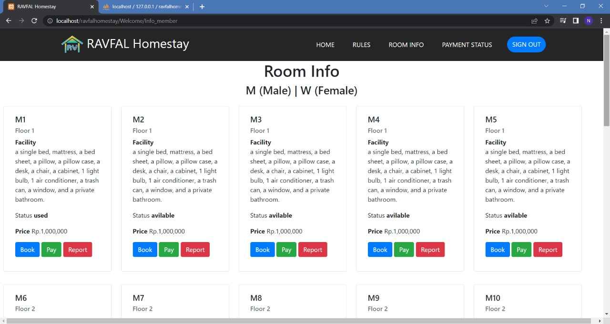
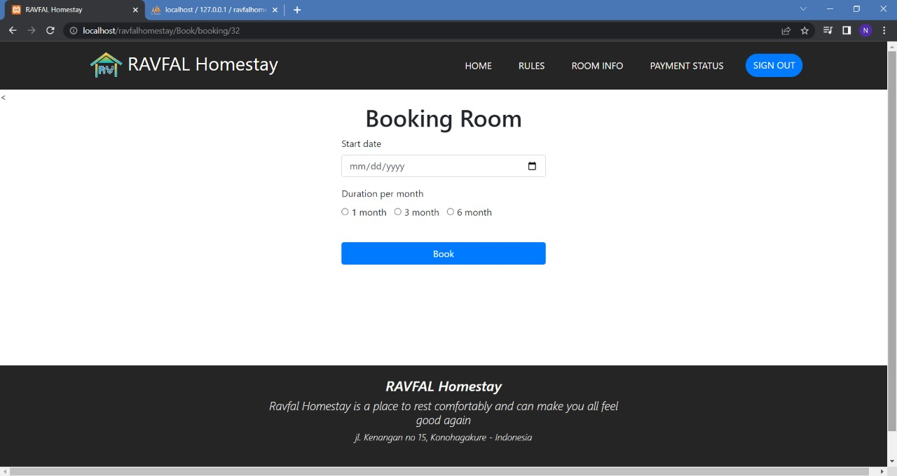
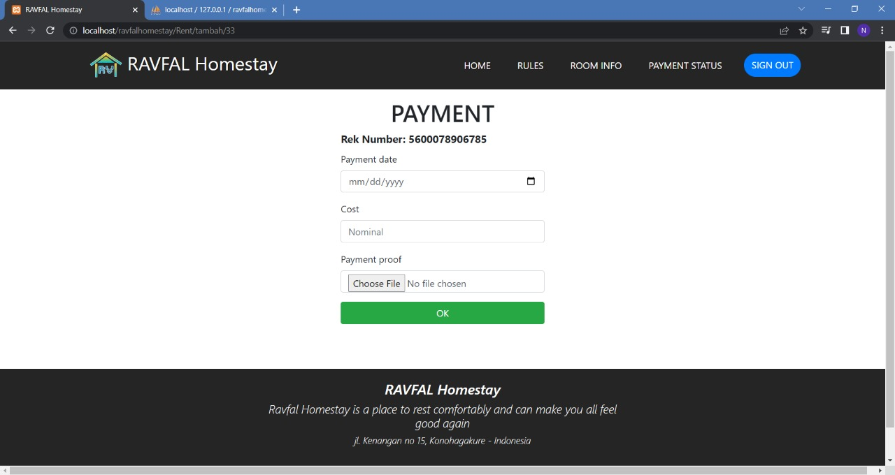
